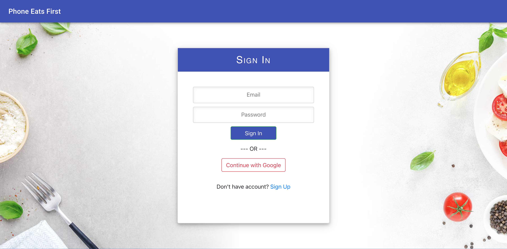
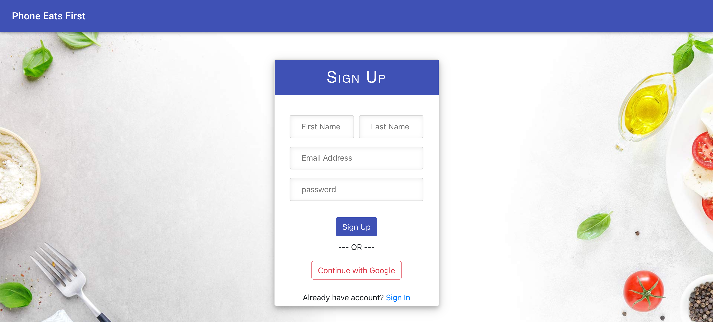

# Phone Eats First

## Table of Contents

- [Technologies Used](#technologies-used)

- [Description](#description)

- [User Story](#user-story)

- [Installation](#installation)

- [Usage](#usage)

- [Deployed Link](#deployed-link)

- [Preview](#preview)

- [Questions](#questions)

## Technologies Used

**Language:** React, Node.js, HTML, CSS

**Database:** MongoDB

**Dependencies:** bcryptjs, express, passport, mongoose, material-ui, axios, bootstrap, react, universal-cookie

**Version Control:** Git, GitHub

**Cloud Platform:** Heroku

## Description

Phone Eats First app, let the user post pictures of what the food actually looks like when it reaches to the table. The user can take a picture and upload post. Also they can like and comment on other user's post. 

## User Story
This app is for someone who hates when they see an advertisement on TV for food and it looks nothing like that when its on your plate. This will save users the disappointment of being let down by their food.

## Installation

To install necessary dependencies, run the following command:

```
npm install
```

## Usage

To run this project, run the following command:

```
npm start
```

## [Deployed Link](https://phone-eats-first.herokuapp.com/)

## Preview

---





---

## Questions

If you have any questions about the repo, open issue or contact us directly at [Phone Eats First](anjalikevadiya5@gmail.com).
